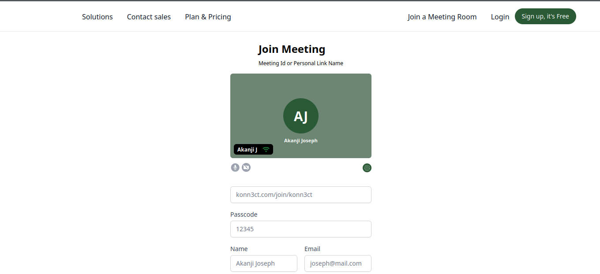
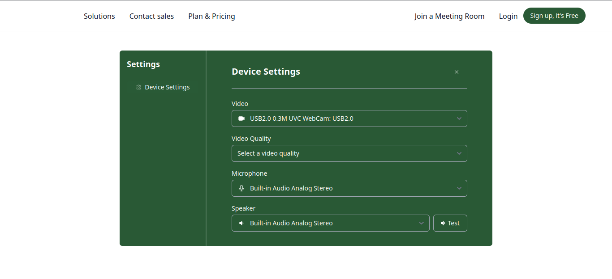

# WebRTC Desktop interface sample design

Visit - [https://webrtc01.netlify.app](https://webrtc01.netlify.app/)

[Firefox browser Demo](https://youtu.be/Mw1RER_nkEA)

<video controls src="firefox_browser_demo.mp4" title="Title"></video>

[Opera browser Demo](https://youtu.be/r91U-JnaW2E)





## Setup

Make sure to install the dependencies:

```bash
# npm
npm install

# pnpm
pnpm install

# yarn
yarn install

# bun
bun install
```

## Development Server

Start the development server on `http://localhost:3000`:

```bash
# npm
npm run dev

# pnpm
pnpm run dev

# yarn
yarn dev

# bun
bun run dev
```

## Production

Build the application for production:

```bash
# npm
npm run build

# pnpm
pnpm run build

# yarn
yarn build

# bun
bun run build
```

Locally preview production build:

```bash
# npm
npm run preview

# pnpm
pnpm run preview

# yarn
yarn preview

# bun
bun run preview
```
